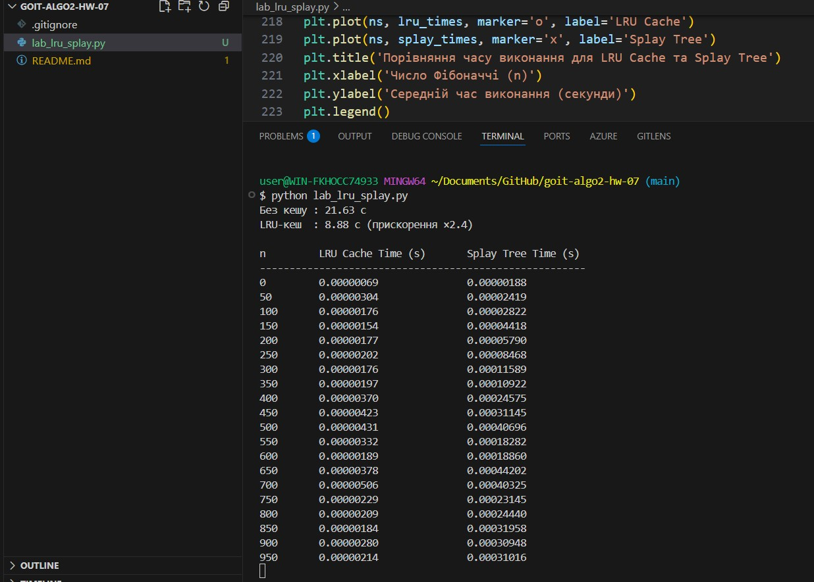
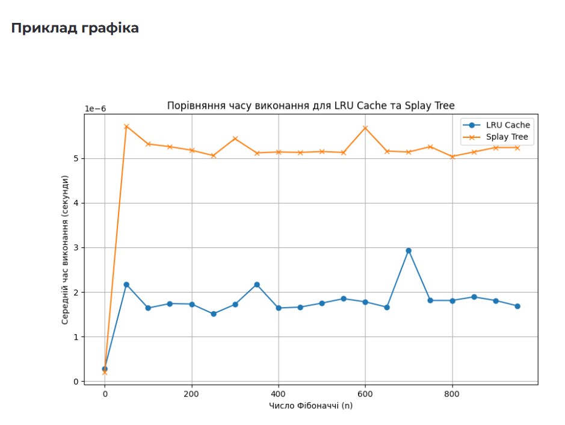

# goit-algo2-hw-07

Алгоритми керування кешем: LRU Cache та Splay Tree
Цей проєкт реалізує два завдання з теми кешування для порівняння продуктивності використання LRU Cache та Splay Tree у практичних сценаріях.

## Завдання 1 — Оптимізація доступу до даних з LRU Cache

Мета:
Порівняти швидкість обробки великої кількості запитів до масиву:

Без кешу

З використанням LRU-кешу

🛠 Реалізація:
Генерується масив array з 100 000 випадкових чисел.

Генерується 50 000 запитів (Range і Update), 95% з них — повторювані “гарячі” діапазони.

Реалізовані функції:

range_sum_no_cache / update_no_cache

range_sum_with_cache / update_with_cache з LRUCache (ємність 1000)

### Результат:

Без кешу : 21.63 c
LRU-кеш : 8.88 c (прискорення ×2.4)

Кешування значно зменшує час обробки запитів завдяки повторному використанню обчислених результатів.

### Завдання 2 — Обчислення чисел Фібоначчі: LRU Cache vs Splay Tree

Мета:
Порівняти ефективність обчислення чисел Фібоначчі двома способами:

З @lru_cache

З Splay Tree

🛠 Реалізація:
fibonacci_lru(n) — з кешуванням через декоратор

fibonacci_splay(n, tree) — зберігає результати в Splay Tree

Час вимірюється через timeit для n від 0 до 950 з кроком 50

### Результати:

n LRU Cache Time (s) Splay Tree Time (s)
0 0.00000069 0.00000188
50 ... ...
950 0.00000214 0.00031016

Splay Tree показує повільніші результати у порівнянні з LRU Cache через складнішу структуру та операції доступу.

Побудований графік:
Вісь X — значення n

Вісь Y — середній час обчислення

Легенда: LRU Cache, Splay Tree

### Висновки

LRU Cache — швидкий та зручний спосіб кешування повторюваних обчислень.

Splay Tree — гнучка структура з самобалансуванням, але менш ефективна в контексті обчислень Фібоначчі.

Кешування — ключовий інструмент оптимізації при великій кількості повторюваних запитів.

### Запуск

python lab_lru_splay.py

### Результати:

